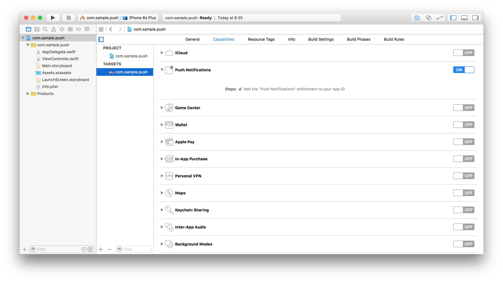

---

copyright:
  years: 2018, 2020
lastupdated: "2020-05-27"

keywords: push notifications, notifications, set up android app for notification, set up iOS app for notification, set up cordova app for notification, set up windows app for notification

subcollection:  mobilefoundation

---

{:external: target="_blank" .external}
{:shortdesc: .shortdesc}
{:codeblock: .codeblock}
{:pre: .pre}
{:screen: .screen}
{:tsSymptoms: .tsSymptoms}
{:tsCauses: .tsCauses}
{:tsResolve: .tsResolve}
{:tip: .tip}
{:important: .important}
{:note: .note}
{:download: .download}


# Handling {{site.data.keyword.mobilepushshort}} in client applications
{: #handling_push_notifications_in_client_applications}

Before iOS, Android and Windows&trade; Native-based or Cordova-based applications are able to receive and display incoming push notifications, the application must first be set up, and APIs must be implemented.
{: shortdesc}

Refer to the following sections to learn how to handle incoming push notifications in client applications:

## Handling {{site.data.keyword.mobilepushshort}} in Android
{: #handling_push_notifications_in_android}

Before Android applications are able to handle any received push notifications, support for Google Play Services needs to be configured. After an application is configured, {{site.data.keyword.mobilefirst_notm}}-provided Notifications API can be used to register &amp; unregister devices, and subscribe &amp; unsubscribe to tags. In this tutorial, you learn how to handle push notification in Android applications.


### Prerequisites
{: #prereqs-andriod}

* {{site.data.keyword.mfserver_short_notm}} to run locally, or a remotely running {{site.data.keyword.mfserver_short_notm}}.
* {{site.data.keyword.mobilefirst_notm}} CLI installed on the developer workstation


### Notifications Configuration
{: #notifications-configuration}

Create a new Android Studio project or use an existing one.  
If the {{site.data.keyword.mobilefirst_notm}} Native Android SDK is not already present in the project, follow the instructions in the [Adding the {{site.data.keyword.mobilefoundation_short}} SDK to Android applications](/docs/mobilefoundation?topic=mobilefoundation-add_sdk_to_app) tutorial.


### Project setup
{: #project-setup}


1. In **Android → Gradle scripts**, select the **build.gradle (Module: app)** file and add the following lines to `dependencies`:


   ```bash
   com.google.android.gms:play-services-gcm:9.0.2
   ```
   {: codeblock}

   There is a [known Google defect](https://code.google.com/p/android/issues/detail?id=212879){: external} preventing use of the latest Play Services version (currently at 9.2.0). Use a version that is less than 9.2.0.
   {: note}

   And:
   
   ```xml
   compile group: 'com.ibm.mobile.foundation',
            name: 'ibmmobilefirstplatformfoundationpush',
            version: '8.0.+',
            ext: 'aar',
            transitive: true
   ```
   {: codeblock}

   Or in a single line:

   ```xml
   compile 'com.ibm.mobile.foundation:ibmmobilefirstplatformfoundationpush:8.0.+'
   ```
   {: codeblock}

1. In **Android → app → manifests**, open the `AndroidManifest.xml` file.
   * Add the following permissions to the beginning the `manifest` tag:

      ```xml
      <!-- Permissions -->
      <uses-permission android:name="android.permission.WAKE_LOCK" />

      <!-- GCM Permissions -->
      <uses-permission android:name="com.google.android.c2dm.permission.RECEIVE" />
      <permission
        android:name="your.application.package.name.permission.C2D_MESSAGE"
        android:protectionLevel="signature" />
      ```
      {: codeblock}

   * Add the following to the `application` tag:

      ```xml
      <!-- GCM Receiver -->
      <receiver
           android:name="com.google.android.gms.gcm.GcmReceiver"
           android:exported="true"
           android:permission="com.google.android.c2dm.permission.SEND">
           <intent-filter>
               <action android:name="com.google.android.c2dm.intent.RECEIVE" />
               <category android:name="your.application.package.name" />
           </intent-filter>
      </receiver>

      <!-- MFPPush Intent Service -->
      <service
            android:name="com.ibm.mobilefirstplatform.clientsdk.android.push.api.MFPPushIntentService"
            android:exported="false">
            <intent-filter>
                <action android:name="com.google.android.c2dm.intent.RECEIVE" />
            </intent-filter>
      </service>

      <!-- MFPPush Instance ID Listener Service -->
      <service
            android:name="com.ibm.mobilefirstplatform.clientsdk.android.push.api.MFPPushInstanceIDListenerService"
            android:exported="false">
            <intent-filter>
                <action android:name="com.google.android.gms.iid.InstanceID" />
            </intent-filter>
      </service>

      <activity android:name="com.ibm.mobilefirstplatform.clientsdk.android.push.api.MFPPushNotificationHandler"
           android:theme="@android:style/Theme.NoDisplay"/>
      ```
      {: codeblock}

      Be sure to replace `your.application.package.name` with the actual package name of your application.
      {: note}

   * Add the following `intent-filter` to the application's activity.

      ```xml
      <intent-filter>
          <action android:name="your.application.package.name.IBMPushNotification" />
          <category android:name="android.intent.category.DEFAULT" />
      </intent-filter>
      ```
      {: codeblock}
     

### Notifications API
{: #notifications-api}

#### MFPPush Instance
{: #mfppush-instance}


All API calls must be called on an instance of `MFPPush`.  You can do the API call by creating a class level field such as `private MFPPush push = MFPPush.getInstance();`, and then calling `push.<api-call>` throughout the class.


Alternatively you can call `MFPPush.getInstance().<api_call>` for each instance in which you need to access the push API methods.


#### Challenge Handlers
{: #challenge-handlers}


If the `push.mobileclient` scope is mapped to a **security check**, you need to make sure that matching challenge handlers exist and are registered before using any of the Push APIs.


Learn more about challenge handlers in the [credential validation](http://mobilefirstplatform.ibmcloud.com/tutorials/en/foundation/8.0/authentication-and-security/credentials-validation/android/){: external} tutorial.
{: note}


#### Client-side
{: #client-side}


| Java&trade; Methods | Description |
|-----------------------------------------------------|-------------------------------------------|
| [`initialize(Context context);`](#initialization) | Initializes MFPPush for supplied context. |
| [`isPushSupported();`](#is-push-supported) | Does the device support push notifications. |
| [`registerDevice(JSONObject, MFPPushResponseListener);`](#register-device) | Registers the device with the Push Notifications Service. |
| [`getTags(MFPPushResponseListener)`](#get-tags) | Retrieves one or more tags available in a push notification service instance. |
| [`subscribe(String[] tagNames, MFPPushResponseListener)`](#subscribe) | Subscribes the device to the specified tags. |
| [`getSubscriptions(MFPPushResponseListener)`](#get-subscriptions) | Retrieves all tags that the device is subscribed to. |
| [`unsubscribe(String[] tagNames, MFPPushResponseListener)`](#unsubscribe) | Unsubscribes from a particular tag. |
| [`unregisterDevice(MFPPushResponseListener)`](#unregister) | Unregisters the device from the Push Notifications Service |
{: caption="Table 1. Java methods" caption-side="top"}
{: android}

##### Initialization
{: #initialization}


Required for the client application to connect to MFPPush service with the correct application context.


* The API method needs to be called first before using any other MFPPush APIs.
* Registers the callback function to handle received push notifications.


```java
MFPPush.getInstance().initialize(this);
```
{: codeblock}


##### Is push supported
{: #is-push-supported}


Checks if the device supports push notifications.


```java
Boolean isSupported = MFPPush.getInstance().isPushSupported();

if (isSupported ) {
    // Push is supported
} else {
    // Push is not supported
}
```
{: codeblock}
{: android}

##### Register device
{: #register-device}


Register the device to the {{site.data.keyword.mobilepushshort}} service.


```java
MFPPush.getInstance().registerDevice(null, new MFPPushResponseListener<String>() {
    @Override
    public void onSuccess(String s) {
        // Successfully registered
    }

    @Override
    public void onFailure(MFPPushException e) {
        // Registration failed with error
    }
});
```
{: codeblock}


##### Get tags
{: #get-tags}


Retrieve all the available tags from the push notification service.
{: android}

```java
MFPPush.getInstance().getTags(new MFPPushResponseListener<List<String>>() {
    @Override
    public void onSuccess(List<String> strings) {
        // Successfully retrieved tags as list of strings
    }

    @Override
    public void onFailure(MFPPushException e) {
        // Failed to receive tags with error
    }
});
```
{: codeblock}


##### Subscribe
{: #subscribe}


Subscribe to desired tags.


```java
String[] tags = {"Tag 1", "Tag 2"};

MFPPush.getInstance().subscribe(tags, new MFPPushResponseListener<String[]>() {
    @Override
    public void onSuccess(String[] strings) {
        // Subscribed successfully
    }

    @Override
    public void onFailure(MFPPushException e) {
        // Failed to subscribe
    }
});
```
{: codeblock}


##### Get subscriptions
{: #get-subscriptions}


Retrieve tags the device is subscribed to.


```java
MFPPush.getInstance().getSubscriptions(new MFPPushResponseListener<List<String>>() {
    @Override
    public void onSuccess(List<String> strings) {
        // Successfully received subscriptions as list of strings
    }

    @Override
    public void onFailure(MFPPushException e) {
        // Failed to retrieve subscriptions with error
    }
});
```
{: codeblock}


##### Unsubscribe
{: #unsubscribe}


Unsubscribe from tags.


```java
String[] tags = {"Tag 1", "Tag 2"};

MFPPush.getInstance().unsubscribe(tags, new MFPPushResponseListener<String[]>() {
    @Override
    public void onSuccess(String[] strings) {
        // Unsubscribed successfully
    }

    @Override
    public void onFailure(MFPPushException e) {
        // Failed to unsubscribe
    }
});
```
{: codeblock}


##### Unregister
{: #unregister}


Unregister the device from push notification service instance.


```java
MFPPush.getInstance().unregisterDevice(new MFPPushResponseListener<String>() {
    @Override
    public void onSuccess(String s) {
        disableButtons();
        // Unregistered successfully
    }

    @Override
    public void onFailure(MFPPushException e) {
        // Failed to unregister
    }
});
```
{: codeblock}


### Handling a {{site.data.keyword.mobilepushshort}}


In order to handle a push notification, you need to set up a `MFPPushNotificationListener`. This can be achieved by implementing one of the following methods.


#### Option One
{: #option-one}


In the activity, in which you want the handle push notifications.


1. Add `implements MFPPushNofiticationListener` to the class declaration.
1. Set the class to be the listener by calling `MFPPush.getInstance().listen(this)` in the `onCreate` method.
1. Then, you need to add the following *required* method:

   ```java
   @Override
   public void onReceive(MFPSimplePushNotification mfpSimplePushNotification) {
        // Handle push notification here
   }
   ```
   {: codeblock}
   {: android}

1. In this method, you receive the `MFPSimplePushNotification` and can handle the notification for the desired behavior.


#### Option Two
{: #option-two}


Create a listener by calling `listen(new MFPPushNofiticationListener())` on an instance of `MFPPush` as outlined in the following example:

```java
MFPPush.getInstance().listen(new MFPPushNotificationListener() {
    @Override
    public void onReceive(MFPSimplePushNotification mfpSimplePushNotification) {
        // Handle push notification here
    }
});
```
{: codeblock}


### Migrate your client Apps on Android to FCM
{: #migrate-to-fcm}


Google Cloud Messaging (GCM) has been [deprecated](https://developers.google.com/cloud-messaging/faq) and is integrated with Firebase Cloud Messaging (FCM). Google turns off most GCM services by April 2019.


If you are using a GCM project, [then migrate the GCM client apps on Android to FCM](https://developers.google.com/cloud-messaging/android/android-migrate-fcm).


For now, the existing applications that use GCM services continue to work as-is. Since the {{site.data.keyword.mobilepushshort}} service has been updated to use the FCM endpoints, going forward all the new applications must be using FCM.


After migrating to FCM, update your project to use FCM credentials instead of the old GCM credentials.
{: note}


#### FCM Project Setup
{: #fcm_project_setup}


Setting up an application in FCM is a bit different compared to the old GCM model.

1. Obtain your notification provider credentials, create an FCM project, and add the same to your Android application. Include the package name of your application as `com.ibm.mobilefirstplatform.clientsdk.android.push`. Refer the [documentation here](/docs/mobilepush?topic=mobilepush-push_step_1#push_step_1_android) until the step where you have finished generating the `google-services.json` file.
   {: android}
1. Configure your Gradle file. Add the following in the app's `build.gradle` file

   ```xml
   dependencies {
      ......
      compile 'com.google.firebase:firebase-messaging:10.2.6'
      .....
   }

   apply plugin: 'com.google.gms.google-services'
   ```
   {: codeblock}
 

   - Add the following dependency in the root build.gradle's `buildscript` section

      `classpath 'com.google.gms:google-services:3.0.0'`
      {: codeblock}
    

   - Remove after GCM plug-in from build.gradle file `compile  com.google.android.gms:play-services-gcm:+`

 
 1. Configure the AndroidManifest file. Following changes are required in the `AndroidManifest.xml`


   Remove the following entries:

   ```xml
   <receiver android:exported="true" android:name="com.google.android.gms.gcm.GcmReceiver" android:permission="com.google.android.c2dm.permission.SEND">
       <intent-filter>
           <action android:name="com.google.android.c2dm.intent.RECEIVE" />
           <category android:name="your.application.package.name" />
       </intent-filter>
       <intent-filter>
           <action android:name="com.google.android.c2dm.intent.REGISTRATION" />
           <category android:name="your.application.package.name" />
       </intent-filter>
   </receiver>  

   <service android:exported="false" android:name="com.ibm.mobilefirstplatform.clientsdk.android.push.api.MFPPushInstanceIDListenerService">
       <intent-filter>
           <action android:name="com.google.android.gms.iid.InstanceID" />
       </intent-filter>
   </service>

   <uses-permission android:name="your.application.package.name.permission.C2D_MESSAGE" />
   <uses-permission android:name="com.google.android.c2dm.permission.RECEIVE" />
   ```
   {: codeblock}


   The following entries need modification:

   ```xml
   <service android:exported="true" android:name="com.ibm.mobilefirstplatform.clientsdk.android.push.api.MFPPushIntentService">
       <intent-filter>
           <action android:name="com.google.android.c2dm.intent.RECEIVE" />
       </intent-filter>
   </service>
   ```
   {: codeblock}

   Modify the entries to:

   ```xml
   <service android:exported="true" android:name="com.ibm.mobilefirstplatform.clientsdk.android.push.api.MFPPushIntentService">
       <intent-filter>
           <action android:name="com.google.firebase.MESSAGING_EVENT" />
       </intent-filter>
   </service>
   ```
   {: codeblock}

   Add the following entry:

   ```xml
   <service android:name="com.ibm.mobilefirstplatform.clientsdk.android.push.api.MFPPush"
           android:exported="true">
           <intent-filter>
               <action android:name="com.google.firebase.INSTANCE_ID_EVENT" />
           </intent-filter>
   </service>
   ```
   {: codeblock}

1. Open the app in Android Studio. Copy the `google-services.json` file that you have created in the **step-1** inside the app directory. Note the `google-service.json` file includes the package name you have added.		

1. Compile the SDK. Build the application.


## Handling Push Notifications in iOS
{: #handling_push_notifications_in_ios}


{{site.data.keyword.mobilefirst_notm}}-provided Notifications API can be used in order to register &amp; unregister devices, and subscribe &amp; unsubscribe to tags. In this tutorial, you learn how to handle push notification in iOS applications by using Swift.
{: shortdesc}


For information about Silent or Interactive notifications, see:

* [Silent Notifications](/docs/mobilefoundation?topic=mobilefoundation-silent_notifications#silent_notifications)
* [Interactive Notifications](/docs/mobilefoundation?topic=mobilefoundation-interactive_notifications#interactive_notifications)


### Prerequisites
{: #prereqs-ios}

* {{site.data.keyword.mfserver_short}} to run locally, or a remotely running {{site.data.keyword.mfserver_short}}.
* {{site.data.keyword.mfp_cli_long_notm}} installed on the developer workstation


### Notifications Configuration
{: #notifications-configuration_ios}


Create a new Xcode project or use and existing one.
If the {{site.data.keyword.mobilefirst_notm}} Native iOS SDK is not already present in the project, follow the instructions in the [Adding the {{site.data.keyword.mobilefoundation_short}} SDK to iOS applications](http://mobilefirstplatform.ibmcloud.com/tutorials/en/foundation/8.0/application-development/sdk/ios/){: external} tutorial.


### Adding the Push SDK
{: #adding-the-push-sdk}


1. Open the project's existing **podfile** and add the following lines:

   ```xml
   use_frameworks!

   platform :ios, 8.0
   target "Xcode-project-target" do
        pod 'IBMMobileFirstPlatformFoundation'
        pod 'IBMMobileFirstPlatformFoundationPush'
   end

   post_install do |installer|
        workDir = Dir.pwd

        installer.pods_project.targets.each do |target|
            debugXcconfigFilename = "#{workDir}/Pods/Target Support Files/#{target}/#{target}.debug.xcconfig"
            xcconfig = File.read(debugXcconfigFilename)
            newXcconfig = xcconfig.gsub(/HEADER_SEARCH_PATHS = .*/, "HEADER_SEARCH_PATHS = ")
            File.open(debugXcconfigFilename, "w") { |file| file << newXcconfig }

            releaseXcconfigFilename = "#{workDir}/Pods/Target Support Files/#{target}/#{target}.release.xcconfig"
            xcconfig = File.read(releaseXcconfigFilename)
            newXcconfig = xcconfig.gsub(/HEADER_SEARCH_PATHS = .*/, "HEADER_SEARCH_PATHS = ")
            File.open(releaseXcconfigFilename, "w") { |file| file << newXcconfig }
        end
   end
   ```
   {: codeblock}


   - Replace **Xcode-project-target** with the name of your Xcode project's target.

1. Save and close the **podfile**.
1. From a **Command-line** window, navigate into to the project's root folder.
1. Run the command `pod install`
1. Open project by using the **.xcworkspace** file.


### Notifications API
{: #notifications-api-ios}


#### MFPPush Instance
{: #mfppush-instance-ios}

All API calls must be called on an instance of `MFPPush`. This can be done by using a `var` in a view controller such as `var push = MFPPush.sharedInstance();`, and then calling `push.methodName()` throughout the view controller.

Alternatively you can call `MFPPush.sharedInstance().methodName()` for each instance in which you need to access the push API methods.


### Challenge Handlers
{: #challenge-handlers-ios}

If the `push.mobileclient` scope is mapped to a **security check**, you need to make sure that matching **challenge handlers** exist and are registered before using any of the Push APIs.

Learn more about challenge handlers in the [credential validation](https://mobilefirstplatform.ibmcloud.com/tutorials/en/foundation/8.0/authentication-and-security/credentials-validation/ios/){: external} tutorial.
{: note}

### Client-side
{: #client-side-ios}

| Swift Methods | Description  |
|---------------|--------------|
| [`initialize()`](#initialization) | Initializes MFPPush for supplied context. |
| [`isPushSupported()`](#is-push-supported) | Does the device support push notifications. |
| [`registerDevice(completionHandler: ((WLResponse!, NSError!) -> Void)!)`](#register-device--send-device-token) | Registers the device with the Push Notifications Service.|
| [`sendDeviceToken(deviceToken: NSData!)`](#register-device--send-device-token) | Sends the device token to the server |
| [`getTags(completionHandler: ((WLResponse!, NSError!) -> Void)!)`](#get-tags) | Retrieves one or more tags available in a push notification service instance. |
| [`subscribe(tagsArray: [AnyObject], completionHandler: ((WLResponse!, NSError!) -> Void)!)`](#subscribe) | Subscribes the device to the specified tags. |
| [`getSubscriptions(completionHandler: ((WLResponse!, NSError!) -> Void)!)`](#get-subscriptions)  | Retrieves all tags the device is subscribed to. |
| [`unsubscribe(tagsArray: [AnyObject], completionHandler: ((WLResponse!, NSError!) -> Void)!)`](#unsubscribe) | Unsubscribes from a particular tags. |
| [`unregisterDevice(completionHandler: ((WLResponse!, NSError!) -> Void)!)`](#unregister) | Unregisters the device from the Push Notifications Service              |
{: caption="Table 2. Swift methods" caption-side="top"}

#### Initialization
{: #initialization-ios}

Initialization is required for the client application to connect to MFPPush service.

* The `initialize` method should be called first before using any other MFPPush APIs.
* It registers the callback function to handle received push notifications.

```swift
MFPPush.sharedInstance().initialize();
```
{: codeblock}

#### Is push supported
{: #is-push-supported-ios}

Checks if the device supports push notifications.

```swift
let isPushSupported: Bool = MFPPush.sharedInstance().isPushSupported()

if isPushSupported {
    // Push is supported
} else {
    // Push is not supported
}
```
{: codeblock}

#### Register device &amp; send device token
{: #register-device--send-device-token-ios}

Register the device to the {{site.data.keyword.mobilepushshort}} service.

```swift
MFPPush.sharedInstance().registerDevice(nil) { (response, error) -> Void in
    if error == nil {
        self.enableButtons()
        self.showAlert("Registered successfully")
        print(response?.description ?? "")
    } else {
        self.showAlert("Registrations failed.  Error \(error?.localizedDescription)")
        print(error?.localizedDescription ?? "")
    }
}
```
{: codeblock}

<!--`options` = `[NSObject : AnyObject]` which is an optional parameter that is a dictionary of options to be passed with your register request, sends the device token to the server to register the device with its unique identifier.-->

```swift
MFPPush.sharedInstance().sendDeviceToken(deviceToken)
```
{: codeblock}

This is typically called in the **AppDelegate** in the `didRegisterForRemoteNotificationsWithDeviceToken` method.
{: note}


#### Get tags
{: #get-tags-ios}

Retrieve all the available tags from the push notification service.

```swift
MFPPush.sharedInstance().getTags { (response, error) -> Void in
    if error == nil {
        print("The response is: \(response)")
        print("The response text is \(response?.responseText)")
        if response?.availableTags().isEmpty == true {
            self.tagsArray = []
            self.showAlert("There are no available tags")
        } else {
            self.tagsArray = response!.availableTags() as! [String]
            self.showAlert(String(describing: self.tagsArray))
            print("Tags response: \(response)")
        }
    } else {
        self.showAlert("Error \(error?.localizedDescription)")
        print("Error \(error?.localizedDescription)")
    }
}
```
{: codeblock}

#### Subscribe
{: #subscribe-ios}

Subscribe to desired tags.

```swift
var tagsArray: [String] = ["Tag 1", "Tag 2"]

MFPPush.sharedInstance().subscribe(self.tagsArray) { (response, error)  -> Void in
    if error == nil {
        self.showAlert("Subscribed successfully")
        print("Subscribed successfully response: \(response)")
    } else {
        self.showAlert("Failed to subscribe")
        print("Error \(error?.localizedDescription)")
    }
}
```
{: codeblock}

#### Get subscriptions
{: #get-subscriptions-ios}

Retrieve tags the device is subscribed to.

```swift
MFPPush.sharedInstance().getSubscriptions { (response, error) -> Void in
   if error == nil {
       var tags = [String]()
       let json = (response?.responseJSON)! as [AnyHashable: Any]
       let subscriptions = json["subscriptions"] as? [[String: AnyObject]]
       for tag in subscriptions! {
           if let tagName = tag["tagName"] as? String {
               print("tagName: \(tagName)")
               tags.append(tagName)
           }
       }
       self.showAlert(String(describing: tags))
   } else {
       self.showAlert("Error \(error?.localizedDescription)")
       print("Error \(error?.localizedDescription)")
   }
}
```
{: codeblock}

#### Unsubscribe
{: #unsubscribe-ios}

Unsubscribe from tags.

```swift
var tags: [String] = {"Tag 1", "Tag 2"};

// Unsubscribe from tags
MFPPush.sharedInstance().unsubscribe(self.tagsArray) { (response, error)  -> Void in
    if error == nil {
        self.showAlert("Unsubscribed successfully")
        print(String(describing: response?.description))
    } else {
        self.showAlert("Error \(error?.localizedDescription)")
        print("Error \(error?.localizedDescription)")
    }
}
```
{: codeblock}

#### Unregister
{: #unregister-ios}

Unregister the device from push notification service instance.


```swift
MFPPush.sharedInstance().unregisterDevice { (response, error)  -> Void in
   if error == nil {
       // Disable buttons
       self.disableButtons()
       self.showAlert("Unregistered successfully")
       print("Subscribed successfully response: \(response)")
   } else {
       self.showAlert("Error \(error?.localizedDescription)")
       print("Error \(error?.localizedDescription)")
   }
}
```
{: codeblock}


### Handling a push notification
{: #handling-a-push-notification-ios}


Push notifications are handled by the native iOS framework directly. Depending on your application lifecycle, different methods are called by the iOS framework.


For example, if a simple notification is received while the application is running, **AppDelegate**'s `didReceiveRemoteNotification` is triggered:


```swift
func application(_ application: UIApplication, didReceiveRemoteNotification userInfo: [AnyHashable: Any]) {
    print("Received Notification in didReceiveRemoteNotification \(userInfo)")
    // display the alert body
      if let notification = userInfo["aps"] as? NSDictionary,
        let alert = notification["alert"] as? NSDictionary,
        let body = alert["body"] as? String {
          showAlert(body)
        }
}
```
{: codeblock}


Learn more about handling notifications in iOS from the [Apple documentation](https://developer.apple.com/library/archive/documentation/NetworkingInternet/Conceptual/RemoteNotificationsPG/APNSOverview.html#//apple_ref/doc/uid/TP40008194-CH8-SW1){: external}.
{: note}


## Handling Push Notifications in Cordova
{: #handling_push_notifications_in_cordova}


Before iOS, Android and Windows Cordova applications are able to receive and display push notifications, the **cordova-plugin-mfp-push** Cordova plug-in needs to be added to the Cordova project. Once an application has been configured, {{ site.data.keyword.mobilefirst_notm }}-provided Notifications API can be used in order to register &amp; unregister devices, subscribe &amp; unsubscribe tags and handle notifications. In this tutorial, you learn how to handle push notification in Cordova applications.
{: shortdesc}


Authenticated notifications are currently **not supported** in Cordova applications due to a defect. However, a workaround is provided: each `MFPPush` API call can be wrapped by `WLAuthorizationManager.obtainAccessToken("push.mobileclient").then( ... );`.
{: note}


For information about Silent or Interactive notifications in iOS, see:


* [Silent Notifications](/docs/mobilefoundation?topic=mobilefoundation-silent_notifications#silent_notifications)
* [Interactive Notifications](/docs/mobilefoundation?topic=mobilefoundation-interactive_notifications#interactive_notifications)


### Prerequisites
{: #prereqs-cordova}

* {{site.data.keyword.mfserver_short}} to run locally, or a remotely running {{site.data.keyword.mfserver_short}}
* {{site.data.keyword.mfp_cli_long_notm}} installed on the developer workstation
* Cordova CLI installed on the developer workstation


### Notifications Configuration
{: #notifications-configuration-cordova}

Create a new Cordova project or use an existing one, and add one or more of the supported platforms: iOS, Android, Windows.

If the {{site.data.keyword.mobilefirst_notm}} Cordova SDK is not already present in the project, follow the instructions in the [Adding the {{site.data.keyword.mobilefirst_notm}} SDK to Cordova applications](http://mobilefirstplatform.ibmcloud.com/tutorials/en/foundation/8.0/application-development/sdk/cordova/) tutorial.
{: note}

### Adding the Push plug-in
{: #adding-the-push-plug-in-cordova}

1. From a **command-line** window, navigate to the root of the Cordova project.  
1. Add the push plug-in to by running the command:

   ```bash
   cordova plugin add cordova-plugin-mfp-push
   ```
   {: codeblock}

1. Build the Cordova project by running the command:

   ```bash
   cordova build
   ```
   {: codeblock}

### iOS platform
{: #ios-platform}

The iOS platform requires an extra step.  

In Xcode, enable push notifications for your application in the **Capabilities** screen.

The bundleId selected for the application must match the AppId that you have previously created in the Apple Developer site.
{: important}



### Android platform
{: #android-platform}

The Android platform requires an extra step.  

In Android Studio, add the following `activity` to the `application` tag:

```xml
<activity android:name="com.ibm.mobilefirstplatform.clientsdk.android.push.api.MFPPushNotificationHandler" android:theme="@android:style/Theme.NoDisplay"/>
```
{: codeblock}

### Notifications API
{: #notifications-api-cordova}

#### Client-side
{: #client-side-cordova}

| JavaScript Function | Description |
| --- | --- |
| [`MFPPush.initialize(success, failure)`](#initialization-cordova) | Initialize the MFPPush instance. |
| [`MFPPush.isPushSupported(success, failure)`](#is-push-supported-cordova) | Does the device support push notifications. |
| [`MFPPush.registerDevice(options, success, failure)`](#register-device-cordova) | Registers the device with the Push Notifications Service. |
| [`MFPPush.getTags(success, failure)`](#get-tags-cordova) | Retrieves all the tags available in a push notification service instance. |
| [`MFPPush.subscribe(tag, success, failure)`](#subscribe-cordova) | Subscribes to a particular tag. |
| [`MFPPush.getSubsciptions(success, failure)`](#get-subscriptions-cordova) | Retrieves the tags device is subscribed to |
| [`MFPPush.unsubscribe(tag, success, failure)`](#unsubscribe-cordova) | Unsubscribes from a particular tag. |
| [`MFPPush.unregisterDevice(success, failure)`](#unregister-cordova) | Unregisters the device from the Push Notifications Service |
{: caption="Table 3. Javascript functions" caption-side="top"}

#### API implementation
{: #api-implementation}

##### Initialization
{: #initialization-cordova}

Initialize the **MFPPush** instance.

- Required for the client application to connect to MFPPush service with the correct application context.  
- The API method should be called first before using any other MFPPush APIs.
- Registers the callback function to handle received push notifications.

```javascript
MFPPush.initialize (
    function(successResponse) {
        alert("Successfully intialized");
        MFPPush.registerNotificationsCallback(notificationReceived);
    },
    function(failureResponse) {
        alert("Failed to initialize");
    }
);
```
{: codeblock}

##### Is push supported
{: #is-push-supported-cordova}

Check whether the device supports push notifications.

```javascript
MFPPush.isPushSupported (
    function(successResponse) {
        alert("Push Supported: " + successResponse);
    },
    function(failureResponse) {
        alert("Failed to get push support status");
    }
);
```
{: codeblock}

##### Register device
{: #register-device-cordova}

Register the device to the {{site.data.keyword.mobilepushshort}} service. If no options are required, options can be set to `null`.

```javascript
var options = { };
MFPPush.registerDevice(
    options,
    function(successResponse) {
        alert("Successfully registered");
    },
    function(failureResponse) {
        alert("Failed to register");
    }
);
```
{: codeblock}

##### Get tags
{: #get-tags-cordova}

Retrieve all the available tags from the push notification service.

```javascript
MFPPush.getTags (
    function(tags) {
        alert(JSON.stringify(tags));
},
    function() {
        alert("Failed to get tags");
    }
);
```
{: codeblock}

##### Subscribe
{: #subscribe-cordova}

Subscribe to desired tags.

```javascript
var tags = ['sample-tag1','sample-tag2'];

MFPPush.subscribe(
    tags,
    function(tags) {
        alert("Subscribed successfully");
    },
    function() {
        alert("Failed to subscribe");
    }
);
```
{: codeblock}

##### Get subscriptions
{: #get-subscriptions-cordova}

Retrieve tags the device is subscribed to.

```javascript
MFPPush.getSubscriptions (
    function(subscriptions) {
        alert(JSON.stringify(subscriptions));
    },
    function() {
        alert("Failed to get subscriptions");
    }
);
```
{: codeblock}

##### Unsubscribe
{: #unsubscribe-cordova}

Unsubscribe from tags.

```javascript
var tags = ['sample-tag1','sample-tag2'];

MFPPush.unsubscribe(
    tags,
    function(tags) {
        alert("Unsubscribed successfully");
    },
    function() {
        alert("Failed to unsubscribe");
    }
);
```
{: codeblock}

##### Unregister
{: #unregister-cordova}

Unregister the device from push notification service instance.

```javascript
MFPPush.unregisterDevice(
    function(successResponse) {
        alert("Unregistered successfully");
    },
    function() {
        alert("Failed to unregister");
    }
);
```
{: codeblock}

### Handling a push notification
{: #handling-a-push-notification-cordova}

You can handle a received push notification by operating on its response object in the registered callback function.

```javascript
var notificationReceived = function(message) {
    alert(JSON.stringify(message));
};
```
{: codeblock}

## Handling Push Notifications in Windows 8.1 Universal and Windows 10 UWP
{: #handling_push_notifications_in_windows}

{{ site.data.keyword.mobilefirst_notm }}-provided Notifications API can be used in order to register &amp; unregister devices, and subscribe &amp; unsubscribe to tags. In this tutorial, you learn how to handle push notification in native Windows 8.1 Universal and Windows 10 UWP applications by using C#.

### Prerequisites
{: #prereqs-windows}

* {{ site.data.keyword.mfserver_short_notm }} to run locally, or a remotely running {{ site.data.keyword.mfserver_short_notm }}.
* {{ site.data.keyword.mobilefirst_notm  }} CLI installed on the developer workstation

### Notifications Configuration
{: #notifications-configuration-windows}

Create a new Visual Studio project or use an existing one.  

If the {{ site.data.keyword.mobilefirst_notm }} Native Windows SDK is not already present in the project, follow the instructions in the [Adding the {{ site.data.keyword.mobilefirst_notm }} SDK to Windows applications](http://mobilefirstplatform.ibmcloud.com/tutorials/en/foundation/8.0/application-development/sdk/windows-8-10/) tutorial.

### Adding the Push SDK
{: #adding-the-push-sdk-windows}

1. Select Tools → NuGet Package Manager → Package Manager Console.
1. Choose the project where you want to install the {{ site.data.keyword.mobilefirst_notm }} Push component.
1. Add the {{ site.data.keyword.mobilefirst_notm }} Push SDK by running the **Install-Package IBM.MobileFirstPlatformFoundationPush** command.

### Pre-requisite WNS configuration
{: pre-requisite-wns-configuration}

1. Ensure that the application is with Toast notification capability. This can be enabled in Package.appxmanifest.
1. Ensure `Package Identity Name` and `Publisher` should be updated with the values that are registered with WNS.
1. (Optional) Delete TemporaryKey.pfx file.

### Notifications API
{: #notifications-api-windows}

#### MFPPush Instance
{: #mfppush-instance-windows}

All API calls must be called on an instance of `MFPPush`.  This can be done by creating a variable such as `private MFPPush PushClient = MFPPush.GetInstance();`, and then calling `PushClient.methodName()` throughout the class.

Alternatively you can call `MFPPush.GetInstance().methodName()` for each instance in which you need to access the push API methods.

#### Challenge Handlers
{: #challenge-handlers-windows}

If the `push.mobileclient` scope is mapped to a **security check**, you need to make sure that matching challenge handlers exist and are registered before using any of the Push APIs.

Learn more about challenge handlers in the [credential validation ](http://mobilefirstplatform.ibmcloud.com/tutorials/en/foundation/8.0/authentication-and-security/credentials-validation/windows-8-10/){: external} tutorial.
{: note}

### Client-side
{: #client-side-windows}

| C Sharp Methods          | Description          |
|--------------------------|----------------------|
| [`Initialize()`](#initialization-windows)                                                                            | Initializes MFPPush for supplied context.                               |
| [`IsPushSupported()`](#is-push-supported-windows)                                                                    | Does the device support push notifications.                             |
| [`RegisterDevice(JObject options)`](#register-device--send-device-token-windows)                  | Registers the device with the Push Notifications Service.               |
| [`GetTags()`](#get-tags-windows)                                | Retrieves the tags available in a push notification service instance. |
| [`Subscribe(String[] Tags)`](#subscribe-windows)     | Subscribes the device to one or more specified tags.                          |
| [`GetSubscriptions()`](#get-subscriptions-windows)              | Retrieves all tags that the device is currently subscribed to.               |
| [`Unsubscribe(String[] Tags)`](#unsubscribe-windows) | Unsubscribes from a particular tags.                                  |
| [`UnregisterDevice()`](#unregister-windows)                     | Unregisters the device from the Push Notifications Service              |
{: caption="Table 4. C Sharp methods" caption-side="top"}

#### Initialization
{: #initialization-windows}

Initialization is required for the client application to connect to MFPPush service.

* The `Initialize` method should be called first before using any other MFPPush APIs.
* It registers the callback function to handle received push notifications.

```csharp
MFPPush.GetInstance().Initialize();
```
{: codeblock}

#### Is push supported
{: #is-push-supported-windows}

Checks if the device supports push notifications.

```csharp
Boolean isSupported = MFPPush.GetInstance().IsPushSupported();

if (isSupported ) {
    // Push is supported
} else {
    // Push is not supported
}
```
{: codeblock}

#### Register device &amp; send device token
{: #register-device--send-device-token-windows}

Register the device to the push notifications service.

```csharp
JObject Options = new JObject();
MFPPushMessageResponse Response = await MFPPush.GetInstance().RegisterDevice(Options);         
if (Response.Success == true)
{
    // Successfully registered
} else {
    // Registration failed with error
}
```
{: codeblock}

#### Get tags
{: #get-tags-windows}

Retrieve all the available tags from the push notification service.

```csharp
MFPPushMessageResponse Response = await MFPPush.GetInstance().GetTags();
if (Response.Success == true)
{
    Message = new MessageDialog("Avalibale Tags: " + Response.ResponseJSON["tagNames"]);
} else{
    Message = new MessageDialog("Failed to get Tags list");
}
```
{: codeblock}

#### Subscribe
{: #subscribe-windows}

Subscribe to desired tags.

```csharp
string[] Tags = ["Tag1" , "Tag2"];

// Get subscription tag
MFPPushMessageResponse Response = await MFPPush.GetInstance().Subscribe(Tags);
if (Response.Success == true)
{
    //successfully subscribed to push tag
}
else
{
    //failed to subscribe to push tags
}
```
{: codeblock}

#### Get subscriptions
{: #get-subscriptions-windows}

Retrieve tags the device is subscribed to.

```csharp
MFPPushMessageResponse Response = await MFPPush.GetInstance().GetSubscriptions();
if (Response.Success == true)
{
    Message = new MessageDialog("Avalibale Tags: " + Response.ResponseJSON["tagNames"]);
}
else
{
    Message = new MessageDialog("Failed to get subcription list...");
}
```
{: codeblock}

#### Unsubscribe
{: #unsubscribe-windows}

Unsubscribe from tags.

```csharp
string[] Tags = ["Tag1" , "Tag2"];

// unsubscribe tag
MFPPushMessageResponse Response = await MFPPush.GetInstance().Unsubscribe(Tags);
if (Response.Success == true)
{
    //succes
}
else
{
    //failed to subscribe to tags
}
```
{: codeblock}

#### Unregister
{: #unregister-windows}

Unregister the device from push notification service instance.

```csharp
MFPPushMessageResponse Response = await MFPPush.GetInstance().UnregisterDevice();         
if (Response.Success == true)
{
    // Successfully registered
} else {
    // Registration failed with error
}
```
{: codeblock}

### Handling a push notification
{: #handling-a-push-notification-windows}

In order to handle a push notification, you need to set up a `MFPPushNotificationListener`. This can be achieved by implementing the following method.

1. Create a class by using interface of type MFPPushNotificationListener

   ```csharp
   internal class NotificationListner : MFPPushNotificationListener
   {
        public async void onReceive(String properties, String payload)
   {
        // Handle push notification here      
   }
   }
   ```
   {: codeblock}

1. Set the class to be the listener by calling `MFPPush.GetInstance().listen(new NotificationListner())`
1. In the onReceive method, you receive the push notification and can handle the notification for the desired behavior.

### Windows Universal Push Notifications Service
{: #windows-universal-push-notifications-service}

No specific port needs to be open in your server configuration.

WNS uses regular http or https requests.
