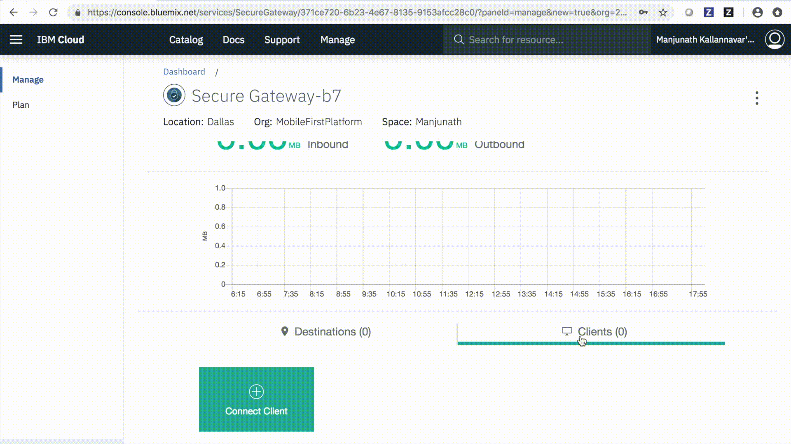
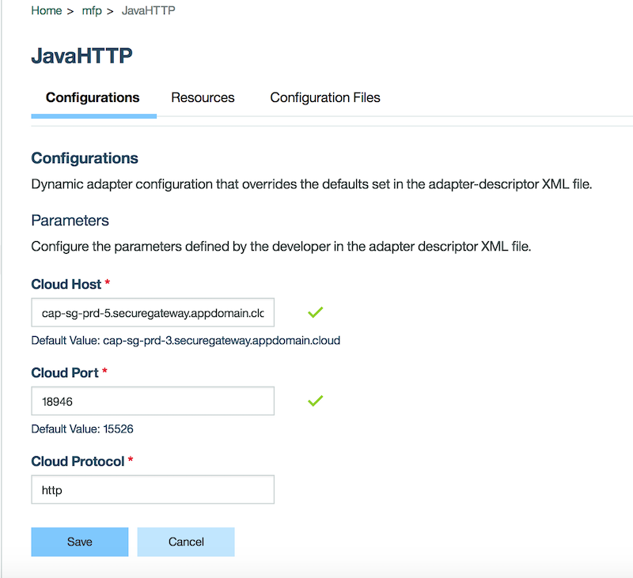

---

copyright:
  years: 2018, 2019
lastupdated: "2019-06-06"

keywords: integration, mobile foundation, secure gateway

subcollection:  mobilefoundation
---

{:shortdesc: .shortdesc}
{:new_window: target="_blank"}
{:tip: .tip}
{:note: .note}
{:pre: .pre}
{:codeblock: .codeblock}
{:screen: .screen}

# Establishing a secure connection to an on-premise system using the Secure Gateway service
{: #integrate_secure_gateway}

When you build enterprise mobile apps, you often want to integrate your apps with existing systems of record. To access and leverage data stored in your on-premise data center from a mobile app, you can use [Mobile Foundation Service](https://cloud.ibm.com/catalog/services/mobile-foundation) with the [Secure Gateway service](https://cloud.ibm.com/catalog/services/secure-gateway) on [IBM Cloud](https://cloud.ibm.com/). Secure Gateway service provides quick, easy and secure connectivity and establishes a tunnel between the IBM Cloud and the remote system that you want to connect to.

This tutorial explains how to access HTTP endpoints in your on-premise data center from Mobile Foundation adapters running on IBM cloud, using Secure Gateway service.

## Prerequisite
{: #prereq_int_sec_gw}

To complete this tutorial, you will need a HTTP endpoint within your  enterprise firewall that exposes the systems of record data. Alternatively, create a test endpoint in your local environment using [this sample ](https://github.com/MobileFirst-Platform-Developer-Center/MFPSecureGatewayIonic/tree/master/NodeJSHTTPProject) `Node.js` project.

Navigate to the project folder and run your HTTP server.

```bash
npm install
node app.js
```
{: codeblock}

## Integration scenario with Secure Gateway service
{: #secure_gateway}

The following image illustrates the architecture used in the integration scenario explained in this tutorial.


## Implementing the Secure Gateway integration
{: #implementing_sg_integration}

### Create a Secure Gateway service instance
Log in to IBM Cloud and create an instance of the [Secure Gateway service](https://cloud.ibm.com/catalog/services/secure-gateway/).


After the Secure Gateway service instance is created, use the following steps to configure the Secure Gateway service between IBM Cloud and your on-premise environment.

### Add a Gateway
{: #add_gateway}

In the Secure Gateway service dashboard, click **Add Gateway**, to create a new gateway by providing any desired gateway name.


### Add a Secure Gateway client
{: #add_sg_client}



From within your new gateway from the **Clients** tab, click **Connect Client**.

You can use any of the clients of your choice and run the Secure Gateway client on your on-premise environment. The steps to setup the Secure Gateway client are available in the Secure Gateway console.

In this tutorial, we will use the Docker container option to run the Secure Gateway client.
Use the following steps:
*   Install Docker on your on-premise machine, if it is not already installed.
*   Launch a terminal and run the Secure Gateway client on a container using the command shown in the service console.
    ```bash
    docker run –it ibmcom/secure-gateway-client <gatewayId>
    ```
    {: codeblock}
    `gatewayId` can be found in the console as shown in the previous image.

### Add a destination
{: #add_destination}


From within your new gateway from the **Destinations** tab, click **Add Destination**.

Secure Gateway service allows you to either connect to an on-premise endpoint from IBM cloud environment or connect from an on-premise environment to a cloud resource. For this scenario, select on-premises as the resource location and provide host name / IP and port of the on-premise resource. Also, provide a destination name of your choice.

To enable the request to be forwarded from the Secure Gateway client to the resource endpoint, you would need to add the resource to the access list.
Run the following command on the terminal of the Secure Gateway client (running as container on Docker runtime, in this scenario) to add the resource to access list.

```
acl allow <resourceHost>:<resourcePort>
```
{: codeblock}
`resourceHost` and `resourcePort` refers to the details of the on-premise resource endpoint.

The destination is now configured. Secure Gateway service will populate cloud host and port details, which can be used to access the on-premise resource from the cloud environment.


### Configuring Secure Gateway service with Mobile Foundation and Mobile Foundation Adapter
{: #configuration_sg_mfp}

In this tutorial, we will use Mobile Foundation service instance on IBM Cloud to configure the Mobile Foundation server. The Mobile Foundation service on IBM cloud helps to provision the Mobile Foundation server on Liberty runtime as a Cloud foundry application. The Mobile Foundation service allows you to take any Mobile Foundation project developed on a local environment and run it on IBM Cloud.

### Mobile Foundation server setup on IBM cloud
{: #mf_server_setup}

Create an instance of the [Mobile Foundation service](https://cloud.ibm.com/catalog/services/mobile-foundation), from the IBM Cloud console.

From the Mobile Foundation service console, create the [Mobile Foundation server ](https://mobilefirstplatform.ibmcloud.com/tutorials/en/foundation/8.0/ibmcloud/using-mobile-foundation/).


### Building and deploying Mobile Foundation Adapter
{: #deploying_mf_adapter}

In this tutorial, we will connect to the Secure Gateway endpoint using a Mobile Foundation adapter. [Download ](https://github.com/MobileFirst-Platform-Developer-Center/Adapters/tree/release80/JavaHTTP) the Mobile Foundation JavaHTTP adapter.

Build and deploy the adapter in Mobile Foundation Operations console using [mfpdev-cli](/docs/services/mobilefoundation?topic=mobilefoundation-mobile_foundation_cli#mobile_foundation_cli) commands.
```bash
mfpdev adapter build
mfpdev adapter deploy
```
{: codeblock}

Learn about building and deploying adapters from [here ](https://mobilefirstplatform.ibmcloud.com/tutorials/en/foundation/8.0/adapters/).
{: tip}

Provide the cloud host and port details for the resource endpoint in the JavaHTTP adapter, got from the previous section.



where `cap-sg-prd-5.securegateway.appdomain.cloud` and `18946` are Secure Gateway host and port respectively.

The Mobile Foundation adapter is now configured and the Mobile Foundation service is now enabled to work with an on-premise system within the enterprise using the Secure Gateway service.

### Creating and registering Mobile Foundation sample app
{: #registering_sample_app}

Download the Mobile Foundation sample app from [here](https://github.com/MobileFirst-Platform-Developer-Center/MFPSecureGatewayIonic/), follow the instructions under the `Readme` and register the app in the Mobile Foundation Operations console.

Run the app, provide credentials to log in and click the *Login* button. Click *Fetch Acme Writers* button to call your on-premise endpoint through Secure Gateway using the JavaHTTP Adapter deployed in your Mobile Foundation Operations console. Receive the desired data from the on-premise environment.


You can connect to multiple on-premise endpoints by configuring multiple destinations on the Secure Gateway service and by deploying Mobile Foundation adapters to connect to the respective cloud host of the endpoint. You can also configure the Secure Gateway service with additional security to ensure that the communication to the endpoint happens over HTTPS and application-side security. You can find the [details here](/docs/services/SecureGateway?topic=securegateway-getting-started-with-sg#getting-started-with-sg).


## Summary
{: #summary_int_sec_gw}

Using this tutorial you should be able to establish a secure connection between the Mobile Foundation adapters running on IBM Cloud and an on-premise HTTP endpoint, using the Secure Gateway service.
