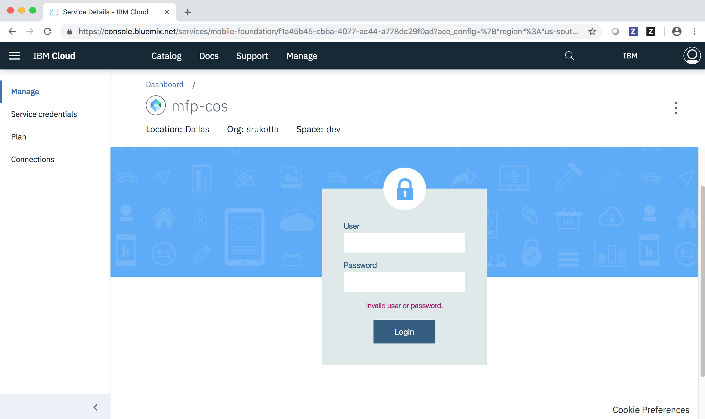
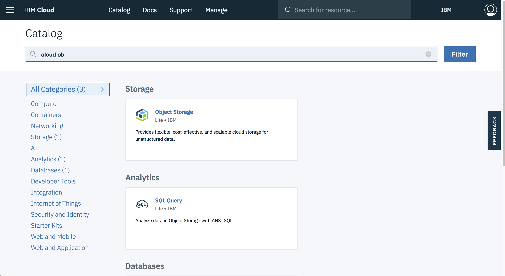
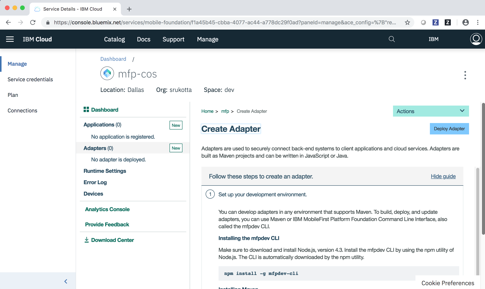

---

copyright:
  years: 2018, 2019
lastupdated: "2019-03-13"

keywords: mobile foundation, integration, cloud object storage, COS, ibm cloud

subcollection:  mobilefoundation
---

{:shortdesc: .shortdesc}
{:new_window: target="_blank"}
{:tip: .tip}
{:note: .note}
{:pre: .pre}
{:codeblock: .codeblock}
{:screen: .screen}
{:java: .ph data-hd-programlang='java'}
{:ruby: .ph data-hd-programlang='ruby'}
{:c#: .ph data-hd-programlang='c#'}
{:objectc: .ph data-hd-programlang='Objective C'}
{:python: .ph data-hd-programlang='python'}
{:javascript: .ph data-hd-programlang='javascript'}
{:php: .ph data-hd-programlang='PHP'}
{:swift: .ph data-hd-programlang='swift'}
{:reactnative: .ph data-hd-programlang='React Native'}
{:csharp: .ph data-hd-programlang='csharp'}
{:ios: .ph data-hd-programlang='iOS'}
{:android: .ph data-hd-programlang='Android'}
{:cordova: .ph data-hd-programlang='Cordova'}
{:xml: .ph data-hd-programlang='xml'}

# Using {{ site.data.keyword.cos_full_notm }} with {{ site.data.keyword.IBM_notm}} {{ site.data.keyword.mobilefoundation_short}}
{: #using_ibm_cloud_object_storage_with_ibm_mobile_foundation}

{{ site.data.keyword.IBM_notm}} {{ site.data.keyword.mobilefoundation_short}} (MF) delivers enterprise-grade capabilities that are uniquely designed to support building and deploying of the next generation of cognitive, contextual, and personalized mobile apps. {{ site.data.keyword.cos_full_notm }} (COS) is a flexible, cost-effective, and scalable cloud storage for unstructured data. This how-to guide explains how a mobile application that uses {{ site.data.keyword.mobilefoundation_short}} can connect and fetch or upload data to {{ site.data.keyword.cos_full_notm }} through an ionic application. The ionic application, adapter, and related files for this how-to tutorial are available [here](https://github.com/MobileFirst-Platform-Developer-Center/COS_MF_Short_Stories_Ionic_App).
{: shortdesc}


## Prerequisites
{: #cos-prerequisites}

1. Install the [mfpdev-cli](https://www.ibm.com/support/knowledgecenter/en/SSHS8R_8.0.0/com.ibm.worklight.dev.doc/dev/c_wl_cli_description.html) by running `npm install -g mfpdev-cli`. This cli is used to register the ionic app and deploy the adapter to the MF server. Alternatively these activities can be performed from the MF server dashboard.

2. Install [{{ site.data.keyword.cloud_notm}} CLI](https://console.bluemix.net/docs/cli/index.html#overview) on your machine.

3. Install ionic cli by executing `npm install -g ionic`

4. Install cordova by executing `npm install -g cordova`


## {{ site.data.keyword.mobilefoundation_short}} Server setup
{: #mobile-foundation-server-setup}

The {{ site.data.keyword.mobilefoundation_short}} server is set on {{ site.data.keyword.cloud_notm}}. Set up an {{ site.data.keyword.cloud_notm}} instance of the {{ site.data.keyword.mobilefoundation_short}} server as follows,

* In the {{ site.data.keyword.cloud_notm}} Catalog, search for "{{ site.data.keyword.mobilefoundation_short}}". Click on the **{{ site.data.keyword.mobilefoundation_short}}** tile.

    

* Provide a suitable name for the {{ site.data.keyword.mobilefoundation_short}} server instance and click on **Create**.

    

* A new MF server instance gets created and asks for login credentials.

    

* The credentials to log in to the MF server can be found in the **Credentials** tab in the left side menu.

    

* Provide these credentials and login to enter the MF dashboard.

    


## Cloud Object Storage Setup
{: #cloud-object-storage-setup}

* In the {{ site.data.keyword.cloud_notm}} Catalog, search for "Cloud Object Storage". Click on the **Object Storage** tile.

    

* Provide a name to your COS instance and click on **Create**.

    

* Next, click on **Buckets** in the left pane menu options. Provide a suitable name (in this sample we chose to name the bucket `sharedgallery`) for your bucket and click on **Create**.

    

* Once the bucket is created, the landing page of the bucket looks like the following image, providing you options to upload data directly.

    

* Here, add the three files that are provided in the **Short stories** folder in the [sample](https://github.com/MobileFirst-Platform-Developer-Center/COS_MF_Short_Stories_Ionic_App).


## MFP-COS Ionic App and Java Adapter
{: #mfp-cos-ionic-app-and-java-adapter}

Download this [git repository](https://github.com/MobileFirst-Platform-Developer-Center/COS_MF_Short_Stories_Ionic_App) or clone it. This repo consists of two main components:

1. An MF Java Adapter
2. An ionic mobile application

### Configuring mfpdev-cli
{: #configuring-mfpdev-cli}

Add the server details to the cli. On the command prompt execute 	`mfpdev server add`.

```
? Enter the name of the new server profile:
```

Provide a name for the server and press enter. In this sample, the name that is provided is `mfpserver`.

```
? Enter the fully qualified URL of this server:
```

Enter the url of the server. For MF server on {{ site.data.keyword.cloud_notm}}, the service credentials tab contains the url. The port for the https MF server on {{ site.data.keyword.cloud_notm}} is 443 and for the http MF server instance is 80.

```
? Enter the MobileFirst Server administrator login ID: (admin)
```

Enter `admin` and press **Enter**.

```
? Enter the MobileFirst Server administrator password:
```

Enter the password available in the service credentials.

```
? Save the administrator password for this server?: (Y/n)
```

Based on your preference, enter *Y/N* and enter details as asked by the prompts.

```
? Enter the MobileFirst Server connection timeout in seconds: 30
```

Set 30 sec as the default timeout

```
? Make this server the default?: (Y/n)
```

Enter *Y* and press **Enter**.

***Expected output***:

```
Verifying server configuration...
The following runtimes are currently installed on this server: mfp
Server profile 'mfpserver' added successfully.
```

### Configuring the MF Java adapter
{: #configuring-the-mf-java-adapter}

To connect to your COS instance, some details of your COS instance need to be provided in the `adapter.xml` file. Furnish values for the following fields:

1. **endpointURL**: This field is the public endpoint url for your COS object. This URL can be found on your COS's dashboard, under **Buckets (on the left menu options) -> <your-bucket-name> (`sharedgallery` in this sample) -> Configuration -> Endpoints -> Public**
2. **AuthToken**: In this tutorial, we are using the IAM authentication.

For the java adapter to connect to your instance of COS, authentication that uses IAM or HMAC is needed. Following are the steps to get the IAM token. For further details on IAM and HMAC authentication processes, click [here](https://cloud.ibm.com/docs/services/cloud-object-storage/api-reference/api-reference-buckets.html#bucket-operations#AuthenticationOptions).

#### Obtaining IAM Oauth token by using {{ site.data.keyword.cloud_notm}} CLI
{: #obtaining-iam-oath-token-using-ibm-cloud-cli}

1. First, make sure that you have an API key. Get the API key from [{{ site.data.keyword.cloud_notm}} Identity and Access Management](https://cloud.ibm.com/iam/#/users).
2. Log in to the {{ site.data.keyword.cloud_notm}} Platform by using the CLI.

  ```bash
	ibmcloud login --apikey <value>
  ```
  {: codeblock}
  Your output is similar to the following snippet,

	```text
	Authenticating...
	OK

	Targeted account <account-name> (<account-id>)

	Targeted resource group default

	API endpoint:     https://api.ng.bluemix.net (API version: 	2.75.0)
	Region:           us-south
	User:             <email-address>
	Account:          <account-name> (<account-id>)
	Resource group:   default
	```

3. To get all the service instances on your {{ site.data.keyword.cloud_notm}} account, run the following command on the CLI.

	```bash
  ibmcloud resource service-instances
  ```
  {: codeblock}

	Expected output:

	```text
 	Retrieving service instances in resource group Default and all 	locations under account <account-name> as <email-address>...
	OK
	Name                                               Location     	State    Type               Tags
	<resource-instance-name>                           global       	active   service_instance
	```

4. Execute the following command to get the details of your COS instance. <instance-name> is the name of your COS service (`newObject` for this tutorial).

  ```bash
	ibmcloud resource service-instance <instance-name>
  ```
  {: codeblock}

	Expected output:

	```text
	Retrieving service instance <sinstance-name> in resource group 	Default under account <account-name> as<email-address>...
	OK

	Name:                  <resource-instance-name>
	ID:                    <resource-instance-id>
	Location:                 global
	Service Name:          cloud-object-storage
	Resource Group Name:   Default
	State:                 active
	Type:                  service_instance
	Tags:
	```

5. To get IAM token, execute the following command:
  ```bash
	ibmcloud iam oauth-tokens
  ```

	Expected output:

	```text
	IAM token:  Bearer <token>
	UAA token:  Bearer <refresh-token>
	```

After you add the *endpointURL* and the *authToken* values, build the adapter. Navigate to the adapter's root folder in the command prompt and execute

```bash
mfpdev adapter build
```
{: codeblock}

The `*.adapter` file is created in the `target` folder. Execute the following command,

```bash
mfpdev adapter deploy
```
{: codeblock}

The adapter is deployed to the MF instance.

Alternatively, the adapter can be deployed on the MF server dashboard. Open the MF server dashboard, on the left side menu, click **Adapters -> New** to open the page as shown in the following image.



Then click on **Deploy Adapter** and upload the `.adapter` file from the **target** folder.


### Configuring the Ionic App
{: #configuring-the-ionic-app}

In the app perform the following steps,

1. Navigate to the folder that contains the Ionic application.

2. Add the cordova MF plugin

	```bash
  ionic cordova plugin add cordova-plugin-mfp
  ```

3. Add the android or iOS platform

  ```bash
	ionic cordova platform add android
  ```
	Or

	```bash
	ionic cordova platform add ios
	```

4. Register your app to the MF server by executing

  ```bash
	mfpdev app register
	```

	Alternatively, the app can be registered on the MF server dashboard. Open the MF server dashboard and on the left side menu click on **Applications -> New**.

	The page as shown in the following image gets loaded.

	

	Enter the details requested. Give a name for your application in the textbox 'Application Name'. Choose the required platform.

	For Android, the **Package** textbox accepts the *Application identifier*. This parameter can be found in the `AndroidManifest.xml` as package of your Android application. The **Version** textbox field has to be filled with the *versionName* value from the `AndroidManifest.xml`.

	For iOS, the **Bundle ID** textbox accepts *Application identifier* (case sensitive). This parameter can be found in the `mfpclient.plist` of your iOS application. The **Version** textbox field has to be filled with the *version* value from the `mfpclient.plist` file in your iOS application.

5. Execute `ionic cordova prepare` for changes to percolate to the environments added.
6. Execute
  ```bash
	ionic cordova build android
  ```
	Or
  ```bash
	ionic cordova build ios
  ```
	to ensure that the typescript changes are added to the environments.

7. Attach device or run an emulator or simulator and execute the following command.

	```bash
  ionic cordova run android
	```
	Or
	```bash
	ionic cordova run ios
  ```

### Navigating the Ionic application
{: #navigating-the-ionic-application}

The Ionic application displays a list of short stories that were uploaded previously (as the last step in the section [Cloud Object Storage Setup](#cloud-object-storage-setup)), from your created COS instance. On selecting a particular story option, the selected story is loaded and displayed. An option to add a story is also provided which is then uploaded to the COS instance.

The initial COS objects list looks like the following image.


The home page of the application provides an option to either "Get all stories" or "Add story"


On clicking **Get all stories**, the stories available on COS are displayed.


Select a story to be loaded from the drop-down menu and click on **Load**


Next, click on the **Add story** button to add a story of your own. Enter a title for the story and the story's content in the text area and click **Add**.


Once the story is added, a message of successful addition of the story is displayed.


The COS dashboard now has the story added from the application as well.


The IAM oauth token that is obtained using `ibmcloud iam oauth-tokens` has an expiration time and the adapter fails with an exception of `403 - Forbidden`. It has to be hence ensured that the token is valid on the deployed adapter for the app to function as expected.
{: note}
