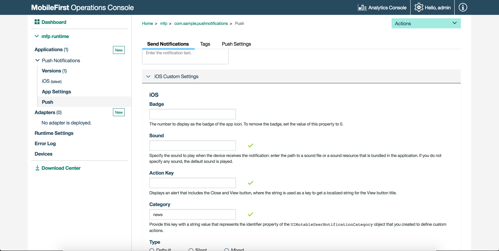

---

copyright:
  years: 2018, 2019
lastupdated: "2019-02-28"

---

{:shortdesc: .shortdesc}
{:new_window: target="_blank"}
{:tip: .tip}
{:note: .note}
{:pre: .pre}
{:codeblock: .codeblock}
{:screen: .screen}
{:java: .ph data-hd-programlang='java'}
{:ruby: .ph data-hd-programlang='ruby'}
{:c#: .ph data-hd-programlang='c#'}
{:objectc: .ph data-hd-programlang='Objective C'}
{:python: .ph data-hd-programlang='python'}
{:javascript: .ph data-hd-programlang='javascript'}
{:php: .ph data-hd-programlang='PHP'}
{:swift: .ph data-hd-programlang='swift'}
{:reactnative: .ph data-hd-programlang='React Native'}
{:csharp: .ph data-hd-programlang='csharp'}
{:ios: .ph data-hd-programlang='iOS'}
{:android: .ph data-hd-programlang='Android'}
{:cordova: .ph data-hd-programlang='Cordova'}
{:xml: .ph data-hd-programlang='xml'}

# Interactive Notifications
{: #interactive_notifications}

With interactive notification, when a notification arrives, users can take actions without opening the application. When an interactive notification arrives, the device shows action buttons along with the notification message.
{: shortdesc}

Interactive notifications are supported on devices with iOS version 8 and above. If an interactive notification is sent to an iOS device with version earlier than 8, the notification actions are not displayed.

## Sending interactive push notification
{: #sending-interactive-push-notification }

Prepare the notification and send notification. For more information, see [Sending push notifications](/docs/services/mobilefoundation?topic=mobilefoundation-send_push_notifications#send_push_notifications).

You can set a string to indicate the category of the notification with the notification object, under **{{ site.data.keyword.mfp_oc_short_notm }} → [your application] → Push → Send Notifications → iOS custom settings**. Based on the category value, the notification action buttons are displayed. For example:



## Handling interactive push notifications in Cordova applications
{: #handling-interactive-push-notifications-in-cordova-applications }

To receive interactive notifications, follow these steps:

1. In the main JavaScript, define the registered categories for interactive notification and pass it to device register call `MFPPush.registerDevice`.

   ```javascript
   var options = {
        ios: {
            alert: true,
            badge: true,
            sound: true,     
            categories: [{
                //Category identifier, this is used while sending the notification.
                id : "poll",

                //Optional array of actions to show the action buttons along with the message.    
                actions: [{
                    //Action identifier
                    id: "poll_ok",

                    //Action title to be displayed as part of the notification button.
                    title: "OK",

                    //Optional mode to run the action in foreground or background. 1-foreground. 0-background. Default is foreground.
                    mode: 1,  

                    //Optional property to mark the action button in red color. Default is false.
                    destructive: false,

                    //Optional property to set if authentication is required or not before running the action.(Screen lock).
                    //For foreground, this property is always true.
                    authenticationRequired: true
                },
                {
                    id: "poll_nok",
                    title: "NOK",
                    mode: 1,
                    destructive: false,
                    authenticationRequired: true
                }],

                //Optional list of actions that is needed to show in the case alert.
                //If it is not specified, then the first four actions will be shown.
                defaultContextActions: ['poll_ok','poll_nok'],

                //Optional list of actions that is needed to show in the notification center, lock screen.
                //If it is not specified, then the first two actions will be shown.
                minimalContextActions: ['poll_ok','poll_nok']
            }]     
        }
   }
   ```

2. Pass the `options` object while registering device for push notifications.

   ```javascript
   MFPPush.registerDevice(options, function(successResponse) {
  		navigator.notification.alert("Successfully registered");
  		enableButtons();
   });  
   ```

## Handling interactive push notifications in native iOS applications
{: #handling-interactive-push-notifications-in-native-ios-applications }

Follow these steps to receive interactive notifications:

1. Enable the application capability to perform background tasks on receiving the remote notifications. This step is required if some of the actions are background-enabled.
2. Define registered categories for interactive notifications and pass them as options to `MFPPush.registerDevice`.

   ```swift
   //define categories for Interactive Push
   let acceptAction = UIMutableUserNotificationAction()
   acceptAction.identifier = "OK"
   acceptAction.title = "OK"
   acceptAction.activationMode = .Foreground

   let rejetAction = UIMutableUserNotificationAction()
   rejetAction.identifier = "Cancel"
   rejetAction.title = "Cancel"
   rejetAction.activationMode = .Foreground

   let category = UIMutableUserNotificationCategory()
   category.identifier = "poll"
   category.setActions([acceptAction, rejetAction], forContext: .Default)

   let categories:Set<UIUserNotificationCategory> = [category]

   let options = ["alert":true, "badge":true, "sound":true, "categories": categories]

   // Register device
    MFPPush.sharedInstance().registerDevice(options as [NSObject : AnyObject], completionHandler: {(response: WLResponse!, error: NSError!) -> Void in
   ```
