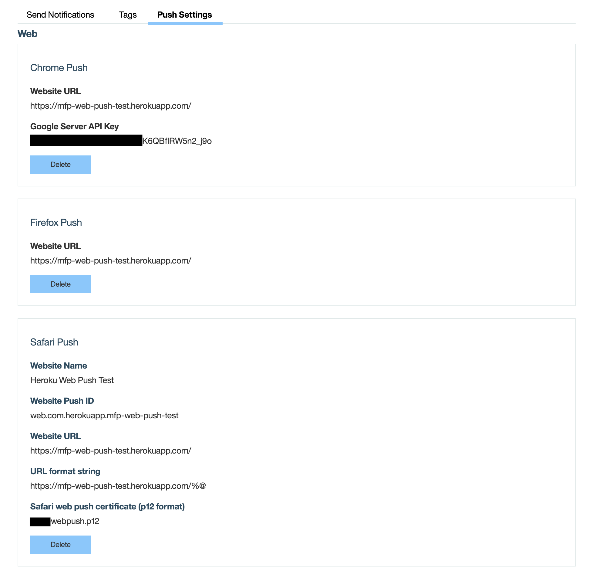
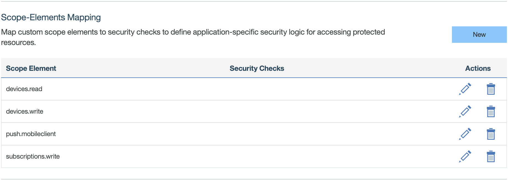

---

copyright:
  years: 2020
lastupdated: "2020-06-11"

keywords: mobile foundation, Push Notifications, notifications, web push notification, configuring web push notifications

subcollection:  mobilefoundation

---

{:external: target="_blank" .external}
{:shortdesc: .shortdesc}
{:codeblock: .codeblock}
{:pre: .pre}
{:screen: .screen}
{:tsSymptoms: .tsSymptoms}
{:tsCauses: .tsCauses}
{:tsResolve: .tsResolve}
{:tip: .tip}
{:important: .important}
{:note: .note}
{:download: .download}
{:java: .ph data-hd-programlang='java'}
{:ruby: .ph data-hd-programlang='ruby'}
{:c#: .ph data-hd-programlang='c#'}
{:objectc: .ph data-hd-programlang='Objective C'}
{:python: .ph data-hd-programlang='python'}
{:javascript: .ph data-hd-programlang='javascript'}
{:php: .ph data-hd-programlang='PHP'}
{:swift: .ph data-hd-programlang='swift'}
{:reactnative: .ph data-hd-programlang='React Native'}
{:csharp: .ph data-hd-programlang='csharp'}
{:ios: .ph data-hd-programlang='iOS'}
{:android: .ph data-hd-programlang='Android'}
{:cordova: .ph data-hd-programlang='Cordova'}
{:xml: .ph data-hd-programlang='xml'}

# Configuring Web Push Notifications
{: #configuring-webpush-notifications}

Before you can send Web push notifications, you need to do some configurations.

Following steps describe how to configure Web push notifications:

1. From the **MobileFirst Operations Console**, go to **Push Settings** tab for your registered web app on Mobile Foundation console.
1. Go to the **Web Configuration** section, here you see three subsections for Chrome, Firefox, and Safari.

   **Configuring web push for Chrome**  

   * Chrome configuration consists of website URL and Google Server API key.
      - **Website URL** - Fully qualified URL of the public website that you want to enable web push notifications for. For example, `https://mfp-web-push-test.herokuapp.com/`.
      - **Google Server API key** - is the API key that you get from the Firebase console for your web app. Go to your **Firebase Project -> Settings -> Cloud Messaging** and copy and paste the **Server Key**.

   **Configuring web push for Firefox**  

   * Firefox configuration is the simplest of all - it relies on the website URL only.
      - **Website URL** - Fully qualified URL of the public website that you want to enable web push notifications for. For example, `https://mfp-web-push-test.herokuapp.com/`.

   **Configuring web push for Safari**  

   * Safari configuration consists of a number of parameters like Website Push ID, URL format string. 
      - **Website Name** - The name of the website. This is the heading that is used in Notification Center.
      - **Website URL** - Fully qualified URL of the public website that you want to enable Web Push Notifications for. For example, `https://mfp-web-push-test.herokuapp.com/`.
      - **Website Push ID** - This is the Push Identifier. It is `web.<website-url-in-reverse-order>`. For example, if the website URL is `https://mfp-web-push-test.herokuapp.com/` then Website Push ID is `web.com.herokuapp.mfp-web-push-test`
      - **URL format string** - The URL to go to when the notification is clicked. Use `%@` as a placeholder for arguments you fill in when delivering the notification. This URL must use the *http* or *https* scheme, otherwise, it is invalid. For example, `https://mfp-web-push-test.herokuapp.com/%@`
      - **Safari web push certificate (p12 format) & password** - The APNS certificate and password.
      - **Notification icons** (Optional) - PNG icon fileset.

   Following image shows how it looks once all the platforms are configured:

   

## Adding the required Security Scopes
{: #configuring-webpush-notifications-security-scopes}

1. Go to **Security** section for your web app.
1. Under **Security Scope-Element Mapping**, add new Scopes as shown in the following image.

   

## KeyStore changes
{: #mf-keystore-changes}

For sending notifications to Chrome and Firefox platforms, your server needs to be trusted origins. To address this requirement, you can pull CA certs from trusted vendor into your Mobile Foundation server keystore file `key.jks`. The following example is for pulling CA certs from Java installations into `key.jks`:

```bash
keytool -importkeystore
-srckeystore /<path-to-java-installation>/jre/lib/security/cacerts
-destkeystore /<mfp-installation-dir>/mfp-server/usr/servers/mfp/resources/security/key.jks
```

You are prompted for Destination KeyStore password. The default is `mobilefirst`.

**Java KeyStore** default password is `changeit` (unless set to something else).

Chrome and Firefox notification token length is large, the customers who upgraded their Mobile Foundation instances need to update their database schema for *PUSH_DEVICES* table by increasing the token length from 255 characters to 1024 characters.
{: important}
