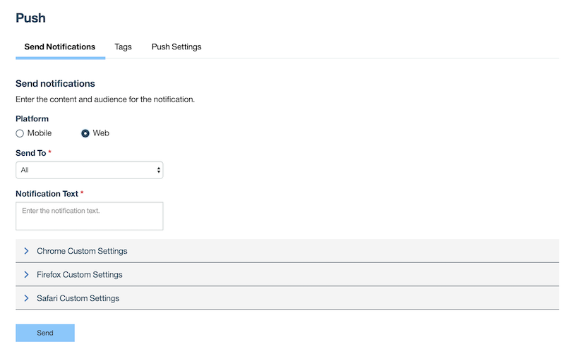
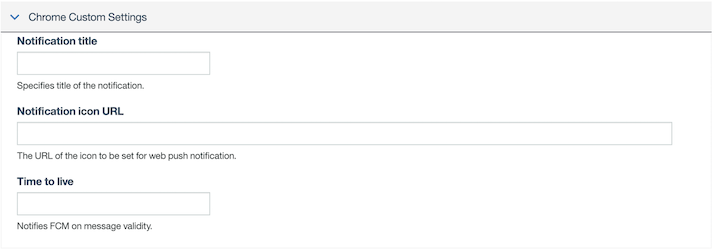
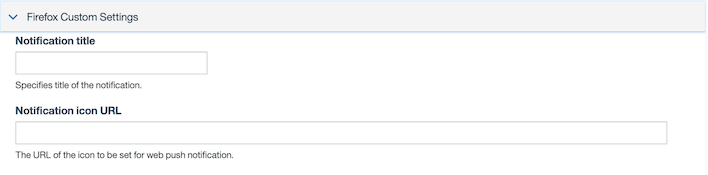
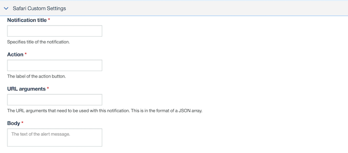

---

copyright:
  years: 2020
lastupdated: "2020-06-11"

keywords: Push Notifications, notifications, web push notification, sending web push notifications

subcollection:  mobilefoundation

---

{:external: target="_blank" .external}
{:shortdesc: .shortdesc}
{:codeblock: .codeblock}
{:pre: .pre}
{:screen: .screen}
{:tsSymptoms: .tsSymptoms}
{:tsCauses: .tsCauses}
{:tsResolve: .tsResolve}
{:tip: .tip}
{:important: .important}
{:note: .note}
{:download: .download}
{:java: .ph data-hd-programlang='java'}
{:ruby: .ph data-hd-programlang='ruby'}
{:c#: .ph data-hd-programlang='c#'}
{:objectc: .ph data-hd-programlang='Objective C'}
{:python: .ph data-hd-programlang='python'}
{:javascript: .ph data-hd-programlang='javascript'}
{:php: .ph data-hd-programlang='PHP'}
{:swift: .ph data-hd-programlang='swift'}
{:reactnative: .ph data-hd-programlang='React Native'}
{:csharp: .ph data-hd-programlang='csharp'}
{:ios: .ph data-hd-programlang='iOS'}
{:android: .ph data-hd-programlang='Android'}
{:cordova: .ph data-hd-programlang='Cordova'}
{:xml: .ph data-hd-programlang='xml'}

# Sending Web {{site.data.keyword.mobilepushshort}}
{: #sending_webpush_notifications}

Sending notifications to web platforms is similar to sending notifications to mobile platforms. For more information, see [Send Push Notifications](/docs/mobilefoundation?topic=mobilefoundation-send_push_notifications).

Before you send web push notifications, you must perform some configuration steps. For more information, see [Configuring Web Push Notifications](/docs/mobilefoundation?topic=mobilefoundation-configuring-webpush-notifications).
{: note}

1. In the **MobileFirst Operations Console → [your application] → Push → Send Notifications** tab, select the **Web** option under **Platform**.

   

1. From the **Send to** drop-down menu, selection the required option. Available options are **Chrome**, **Firefox**, and **Safari** based on the platform configured. Each platform comes with an associated custom settings section, as required by the platform. You can also target a Notification to **All** platforms, **Devices by Tags**, **Devices by User ID** or to a **Single Device**.
1. Configure the custom settings for the selected browsers.
1. Enter the **Notification Text** information.
1. Click **Send**.

## Chrome custom settings
{: #chrome_custom_settings}

Following custom setting details are specific to Chrome:

- **Notification Title** - Specifies title of the notification.
- **Notification Icon Url** - The URL of the icon to be set for web push notification.
- **Time to live** - Notifies FCM on message validity.

## Firefox custom settings
{: #firefox_custom_settings}

Following custom setting details are specific to Firefox:

- **Notification Title** - Specifies title of the notification.
- **Notification Icon Url** - The URL of the icon to be set for web push notification.

## Safari custom settings
{: #safari_custom_settings}

Following custom setting details are specific to Safari:

- **Notification Title** - Specifies title of the notification.
- **Action** - The label of the action button.
- **URL arguments** - The URL arguments that need to be used with this notification. The format is a JSON array.
- **Body** - The body of the Notification.

Sending *Tag* based Notifications, *Device ID* and *User ID*-based notifications are similar to what we do for mobile platforms.
