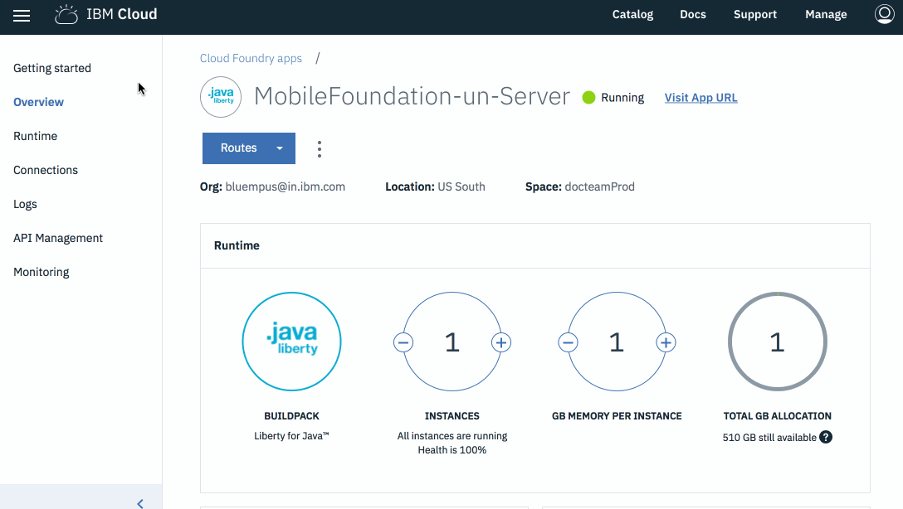

---

copyright:
  years: 2019, 2020
lastupdated: "2020-05-27"

keywords: mobile foundation, logging and tracing, accessing server logs, logging, tracing

subcollection:  mobilefoundation

---

{:external: target="_blank" .external}
{:shortdesc: .shortdesc}
{:codeblock: .codeblock}
{:pre: .pre}
{:screen: .screen}
{:tsSymptoms: .tsSymptoms}
{:tsCauses: .tsCauses}
{:tsResolve: .tsResolve}
{:tip: .tip}
{:important: .important}
{:note: .note}
{:download: .download}
{:java: .ph data-hd-programlang='java'}
{:ruby: .ph data-hd-programlang='ruby'}
{:c#: .ph data-hd-programlang='c#'}
{:objectc: .ph data-hd-programlang='Objective C'}
{:python: .ph data-hd-programlang='python'}
{:javascript: .ph data-hd-programlang='javascript'}
{:php: .ph data-hd-programlang='PHP'}
{:swift: .ph data-hd-programlang='swift'}
{:reactnative: .ph data-hd-programlang='React Native'}
{:csharp: .ph data-hd-programlang='csharp'}
{:ios: .ph data-hd-programlang='iOS'}
{:android: .ph data-hd-programlang='Android'}
{:cordova: .ph data-hd-programlang='Cordova'}
{:xml: .ph data-hd-programlang='xml'}

# Logging and tracing
{: #logging-and-tracing}

{{site.data.keyword.mobilefoundation_long}} helps you with logging and tracing of your app. This section explains how to familiarize yourself with logging and tracing of your app. 
{: shortdesc}

## Accessing server logs
{: #accessing-server-logs }

To access server logs, go through the following scenario:

### Scenario 1
{: #scenario-1}

To manage the {{site.data.keyword.cloud_notm}} Cloud Foundry app and run the following commands, you need to have the [{{site.data.keyword.cloud_notm}} Command-Line Tool](https://github.com/cloudfoundry/cli/releases){: external} installed. Download and install the {{site.data.keyword.cloud_notm}} CLI.
{: Note}

1. To view the recent logs, open the terminal session and run the following command:

   ```bash
   ibmcloud cf logs <appname> –-recent
   ```
   {: codeblock}
    
   where `<appname>` is the application name.

   For example: `ibmcloud cf logs mobilefoundation-serverapp –-recent`

1. Open the terminal and Log in to the Cloud Foundry Application instance of your *Organization* and *Space*.

   ```bash
   ibmcloud cf ssh <appname> [ -i instance_index ]
   ```
   {: codeblock}

   where `<appname>` is the application name.

   For example: `ibmcloud cf ssh mfpserver –i 0`
    
1. Go to the logs directory:

   ```bash
   cd logs
   ```
   {: codeblock}
 
   You are able to see the following log files:

   ``` 
   ./message-*.log
   ./ffdc/
   ```

1. Copy the logs from the Cloud Foundry Application to your local system:

   ```bash
   ibmcloud cf ssh <appname> -i 0 -c “cat /home/vcap/logs/file-name” > ./file-name
   ```
   {: codeblock}

   For example, *ibmcloud cf ssh `<appname>` -i 0 -c “cat /home/vcap/logs/message.log” > ./message.log*

1. Only if trace is enabled, run the following command:
 
   ```bash
   cf ssh <mfp_Appname> -c "/bin/cat logs/trace.log" > trace.log
   ```
   {: codeblock}

### Scenario 2
{: #scenario-2}

You can access the logs through IBM Cloud console. 

1. Log in to [https://cloud.ibm.com/](https://cloud.ibm.com/).
1. On the IBM Cloud dashboard, go to **Cloud Foundry Apps** and Select your app.
1. Click on your app's entry to open the details, and then go to **Logs**. Current logs are shown with the most recent at the end. You can search for an entry or filter by log type. Select **Application (APP)**.
1. Select your App and click **Logs → View in Kibana**.
1. Select and copy the logs messages.

## Tracing
{: #tracing }

To enable tracing in {{site.data.keyword.mobilefoundation_short}} Cloud Foundry App in order to view DEBUG-level messages in the **trace.log** file:

1. Log in to the Cloud Foundry application instance that the Mobile Foundation service instance has created:

   ```
   ibmcloud cf ssh <appname> [-i instance_index ]
   ```
   {: codeblock}

1. Go to each instance in the console and open the file `/home/vcap/app/wlp/usr/servers/mfp/configDropins/overrides/tracespec.xml` in vi editor.
1. Update the following trace statement: 
   `traceSpecification="=info:com.ibm.mfp.*=all"` 
   and save the file.

   The `server.xml` or `tracespec.xml` change will be lost on a restage or restart. It is only valid for the instance to which you run `ssh`, so you must enable traces on all the instances of your application."
   {: note}

The **trace.log** file is now available in the specified location.


