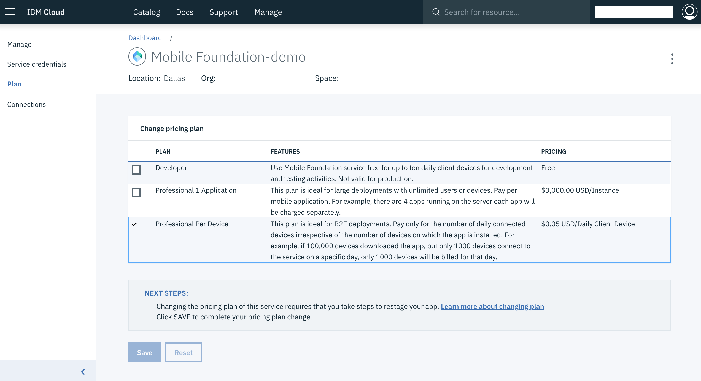
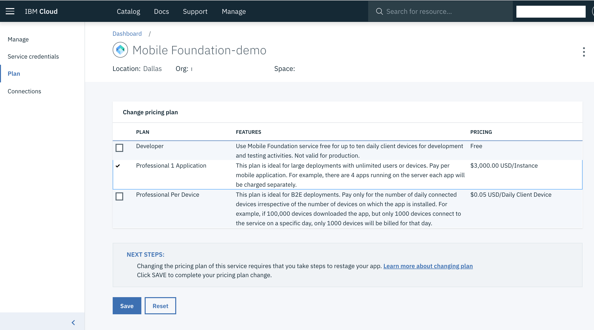

---

copyright:
  years: 2018, 2020
lastupdated: "2020-05-27"

keywords: mobile foundation plans, migration of plans

subcollection:  mobilefoundation

---

{:external: target="_blank" .external}
{:shortdesc: .shortdesc}
{:codeblock: .codeblock}
{:pre: .pre}
{:screen: .screen}
{:tsSymptoms: .tsSymptoms}
{:tsCauses: .tsCauses}
{:tsResolve: .tsResolve}
{:tip: .tip}
{:important: .important}
{:note: .note}
{:download: .download}
{:java: .ph data-hd-programlang='java'}
{:ruby: .ph data-hd-programlang='ruby'}
{:c#: .ph data-hd-programlang='c#'}
{:objectc: .ph data-hd-programlang='Objective C'}
{:python: .ph data-hd-programlang='python'}
{:javascript: .ph data-hd-programlang='javascript'}
{:php: .ph data-hd-programlang='PHP'}
{:swift: .ph data-hd-programlang='swift'}
{:reactnative: .ph data-hd-programlang='React Native'}
{:csharp: .ph data-hd-programlang='csharp'}
{:ios: .ph data-hd-programlang='iOS'}
{:android: .ph data-hd-programlang='Android'}
{:cordova: .ph data-hd-programlang='Cordova'}
{:xml: .ph data-hd-programlang='xml'}

# Migrating the {{site.data.keyword.mobilefoundation_short}} service plan

{{site.data.keyword.mobilefoundation_short}} instances, which was created by using the deprecated plans need to be updated to the new plans. Plan update might also be needed based on the instance usage.
{: shortdesc}

## Sample scenario: Migrating from the Professional Per Device plan to the Professional 1 Application plan

1. From the IBM Cloud dashboard, select the {{site.data.keyword.IBM_notm}} {{site.data.keyword.mobilefoundation_short}} instance that you want to migrate.
1. Select **Plan** from the navigation.
   
1. From the listed pricing plans, select Professional 1 Application.
   
1. Click **Save** and confirm the plan migration.
   Migration to Professional 1 Application is now completed and all the existing data is retained. The billing is changed and there’s no downtime.
1. After the plan migration, the Mobile Foundation instance needs to be re-created from the service dashboard for the correct configuration to take effect. This update requires a short downtime. You need to plan for the downtime. Select **Manage** from the navigation and click **Recreate**.

If you’re on one of the deprecated plans, you must migrate to a new plan.
{: note}

## Supported plan migrations

* *Developer* (deprecated) plan can be updated only to the new *Developer* plan.
* *Developer Pro* (deprecated) plan can be updated only to *Professional Per Device* or *Professional 1 Application* plan.
* *Professional Per Capacity* (deprecated) plan can be updated only to *Professional Per Device* or *Professional 1 Application* plan.
* *Professional Per Device* plan can be updated only to *Professional 1 Application* plan.
* *Professional 1 Application* plan can be updated only to *Professional Per Device* plan.
* Plan update isn’t supported for the new *Developer* plan.
